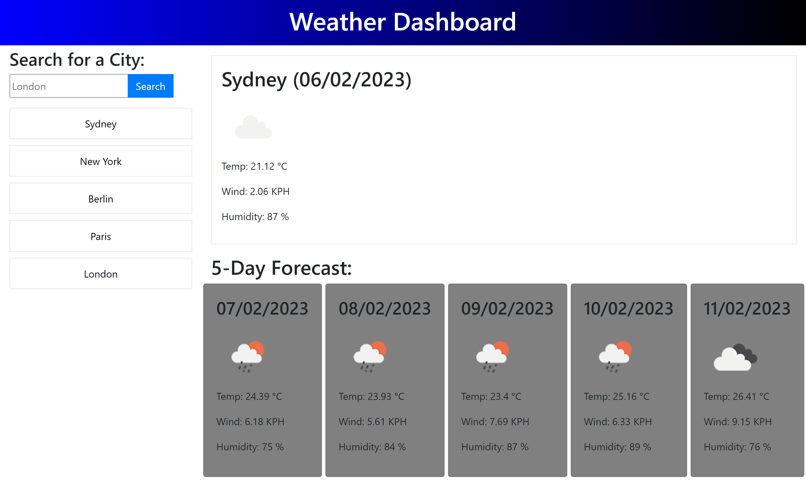

# BC-WeatherDashboard

## Summary

A weather forecast app that gives the current weather and a five day look ahead as provided by openweathermap.org APIs for a users search. It also saves the past 5 locations that the user has searched for in localstorage.

## Tech Used

- HTML5
- CSS3
- Bootstrap
- Javascript
- jQuery
- moment.js
- Server APIs

## Screenshot

## Link to App
[Weather Dashboard](https://stevejr86.github.io/BC-Weather-Dashboard/)